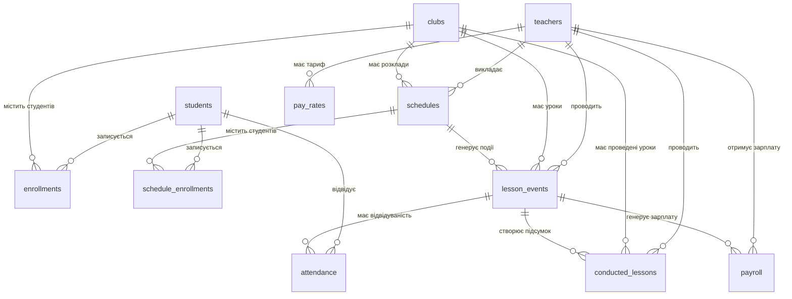

# 📚 Документація Схеми Бази Даних
## 🏫 Система Управління Школою Життя

---

**📅 Остання оновлення:** 15 вересня 2025  
**📝 Версія схеми:** 2.0  
**🗃️ СУБД:** PostgreSQL 15+  

---

## 📋 Зміст

1. [Огляд Системи](#огляд-системи)
2. [Схема Таблиць](#схема-таблиць)
3. [Зв'язки між Таблицями](#звязки-між-таблицями)
4. [Індекси та Оптимізація](#індекси-та-оптимізація)
5. [Constraints та Валідація](#constraints-та-валідація)
6. [Міграції та Зміни](#міграції-та-зміни)
7. [API та Інтеграції](#api-та-інтеграції)
8. [Backup та Моніторинг](#backup-та-моніторинг)

---

## 🎯 Огляд Системи

Система управління школою підтримує:
- 👥 **Управління студентами** та їх пільгами
- 👨‍🏫 **Управління вчителями** та їх зарплатами  
- 🎯 **Управління гуртками** та розкладами
- 📚 **Облік проведених уроків** та відвідуваності
- 🤖 **Telegram-бот** для автоматичних сповіщень
- 💰 **Система розрахунку зарплат**

---

## 📊 Схема Таблиць

### 👥 Студенти (`students`)

Основна інформація про учнів школи.

```sql
CREATE TABLE students (
    id SERIAL PRIMARY KEY,
    first_name VARCHAR(100) NOT NULL,
    last_name VARCHAR(100) NOT NULL,
    birth_date DATE,
    age INTEGER,
    grade VARCHAR(20),
    phone_child VARCHAR(20),
    location VARCHAR(100),
    address TEXT,
    
    -- 👨‍👩‍👧‍👦 Інформація про батьків (МІГРОВАНО)
    parent_name VARCHAR(200),          -- DEPRECATED: буде видалено
    father_name VARCHAR(200),          -- NEW: ПІБ батька  
    mother_name VARCHAR(200),          -- NEW: ПІБ матері
    phone_mother VARCHAR(20),
    phone_father VARCHAR(20),
    
    -- 🏘️ Додаткова інформація
    settlement_type VARCHAR(50),       -- тип населеного пункту
    benefit_other TEXT,                -- інші пільги
    
    -- 🔒 Пільги та соціальні статуси
    benefit_low_income BOOLEAN DEFAULT FALSE,
    benefit_large_family BOOLEAN DEFAULT FALSE, 
    benefit_military_family BOOLEAN DEFAULT FALSE,
    benefit_internally_displaced BOOLEAN DEFAULT FALSE,
    benefit_orphan BOOLEAN DEFAULT FALSE,
    benefit_disability BOOLEAN DEFAULT FALSE,
    benefit_social_risk BOOLEAN DEFAULT FALSE,
    
    -- 🗃️ Системні поля
    benefits_json JSONB,               -- Legacy JSON поле
    raw_row_id INTEGER,                -- ID з імпорту
    created_at TIMESTAMP WITH TIME ZONE DEFAULT NOW()
);
```

**🔗 Зв'язки:**
- `enrollments` (1:N) - записи студента на гуртки
- `schedule_enrollments` (1:N) - записи на конкретні розклади  
- `attendance` (1:N) - відвідуваність студента

**📊 Індекси:**
- `idx_students_name_lower` - пошук за ім'ям (регістронезалежний)
- `idx_students_location` - фільтрація за локацією

---

### 👨‍🏫 Вчителі (`teachers`)

Інформація про педагогічний склад.

```sql
CREATE TABLE teachers (
    id SERIAL PRIMARY KEY,
    full_name VARCHAR(200) NOT NULL,
    email VARCHAR(100) UNIQUE,
    phone VARCHAR(20),
    
    -- 🤖 Telegram інтеграція
    tg_chat_id BIGINT UNIQUE,          -- Telegram Chat ID
    
    -- 🏢 Статус
    active BOOLEAN DEFAULT TRUE,
    
    -- 🗃️ Системні поля  
    created_at TIMESTAMP WITH TIME ZONE DEFAULT NOW()
);
```

**🔗 Зв'язки:**
- `lesson_events` (1:N) - події уроків вчителя
- `conducted_lessons` (1:N) - проведені уроки
- `payroll` (1:N) - нарахування зарплати
- `pay_rates` (1:N) - тарифи вчителя

**📊 Індекси:**
- `idx_teachers_name_lower` - пошук за ім'ям
- `idx_teachers_tg_chat_id` - Telegram інтеграція
- `idx_teachers_active` - активні вчителі

---

### 🎯 Гуртки (`clubs`)

Навчальні гуртки та секції.

```sql
CREATE TABLE clubs (
    id SERIAL PRIMARY KEY,
    name VARCHAR(200) NOT NULL,
    description TEXT,
    duration_min INTEGER,             -- тривалість заняття в хвилинах
    created_at TIMESTAMP WITH TIME ZONE DEFAULT NOW()
);
```

**🔗 Зв'язки:**
- `enrollments` (1:N) - записи студентів на гурток
- `schedules` (1:N) - розклади гуртка
- `lesson_events` (1:N) - події уроків
- `conducted_lessons` (1:N) - проведені уроки

---

### 📅 Розклади (`schedules`)

Розклад занять для гуртків.

```sql
CREATE TABLE schedules (
    id SERIAL PRIMARY KEY,
    club_id INTEGER NOT NULL REFERENCES clubs(id),
    teacher_id INTEGER NOT NULL REFERENCES teachers(id),
    day_of_week INTEGER NOT NULL,     -- 0=Понеділок, 6=Неділя
    start_time TIME NOT NULL,
    end_time TIME NOT NULL,
    created_at TIMESTAMP WITH TIME ZONE DEFAULT NOW()
);
```

---

### 📝 Записи на Гуртки (`enrollments`)

Записи студентів на гуртки (загальні).

```sql
CREATE TABLE enrollments (
    id SERIAL PRIMARY KEY,
    student_id INTEGER NOT NULL REFERENCES students(id),
    club_id INTEGER NOT NULL REFERENCES clubs(id),
    enrolled_at TIMESTAMP WITH TIME ZONE DEFAULT NOW(),
    
    UNIQUE(student_id, club_id)
);
```

**📊 Індекси:**
- `idx_enrollments_club_student` - пошук за гуртком та студентом
- `idx_enrollments_student` - всі гуртки студента

---

### 📅 Записи на Розклади (`schedule_enrollments`)

Записи студентів на конкретні розклади.

```sql
CREATE TABLE schedule_enrollments (
    id SERIAL PRIMARY KEY,
    student_id INTEGER NOT NULL REFERENCES students(id),
    schedule_id INTEGER NOT NULL REFERENCES schedules(id),
    enrolled_at TIMESTAMP WITH TIME ZONE DEFAULT NOW(),
    
    UNIQUE(student_id, schedule_id)
);
```

**📊 Індекси:**
- `idx_schedule_enrollments_schedule` - студенти розкладу
- `idx_schedule_enrollments_student` - розклади студента

---

### 📚 Події Уроків (`lesson_events`)

Заплановані та проведені уроки.

```sql
CREATE TABLE lesson_events (
    id SERIAL PRIMARY KEY,
    
    -- 🔗 Зв'язки (schedule_id може бути NULL для manual lessons)
    schedule_id INTEGER REFERENCES schedules(id),  -- ✅ NULLABLE після міграції
    teacher_id INTEGER NOT NULL REFERENCES teachers(id),
    club_id INTEGER NOT NULL REFERENCES clubs(id),
    
    -- 📅 Дата та час
    date DATE NOT NULL,
    start_at TIMESTAMP WITH TIME ZONE,
    
    -- 📊 Статус (ENUM)
    status lessoneventstatus NOT NULL DEFAULT 'PLANNED',
    -- Можливі значення: PLANNED, SENT, COMPLETED, SKIPPED
    
    -- 🤖 Telegram інтеграція
    teacher_chat_id BIGINT,
    notify_at TIMESTAMP WITH TIME ZONE,
    sent_at TIMESTAMP WITH TIME ZONE,
    send_attempts INTEGER DEFAULT 0,
    last_error TEXT,
    
    -- 🗃️ Метадані
    idempotency_key VARCHAR(255),
    payload JSONB,
    
    -- 🗃️ Системні поля
    created_at TIMESTAMP WITH TIME ZONE DEFAULT NOW(),
    completed_at TIMESTAMP WITH TIME ZONE
);
```

**📊 Індекси:**
- `idx_lesson_events_date_status` - фільтрація за датою та статусом
- `idx_lesson_events_teacher_date` - уроки вчителя за датою
- `idx_lesson_events_club_date` - уроки гуртка за датою
- `idx_lesson_events_notify_at` - нотифікації для обробки
- `idx_lesson_events_composite` - композитний індекс

---

### ✅ Відвідуваність (`attendance`)

Облік відвідуваності студентів.

```sql
CREATE TABLE attendance (
    id SERIAL PRIMARY KEY,
    lesson_event_id INTEGER NOT NULL REFERENCES lesson_events(id),
    student_id INTEGER NOT NULL REFERENCES students(id),
    
    -- 📊 Статус відвідуваності (ENUM)
    status attendancestatus NOT NULL,
    -- Можливі значення: PRESENT, ABSENT
    
    -- 🗃️ Метадані
    marked_by BIGINT,                 -- Telegram Chat ID того, хто відмітив
    marked_at TIMESTAMP WITH TIME ZONE DEFAULT NOW(),
    
    UNIQUE(lesson_event_id, student_id)
);
```

**📊 Індекси:**
- `idx_attendance_student_status` - статистика по студентах
- `idx_attendance_lesson_event` - відвідуваність уроку

---

### 📋 Проведені Уроки (`conducted_lessons`)

Підсумки проведених занять.

```sql
CREATE TABLE conducted_lessons (
    id SERIAL PRIMARY KEY,
    
    -- 🔗 Зв'язки
    teacher_id INTEGER NOT NULL REFERENCES teachers(id),
    club_id INTEGER NOT NULL REFERENCES clubs(id),
    lesson_event_id INTEGER REFERENCES lesson_events(id),
    
    -- 📅 Дата та час
    lesson_date TIMESTAMP WITH TIME ZONE NOT NULL,
    lesson_duration_minutes INTEGER,
    
    -- 👥 Статистика відвідуваності
    total_students INTEGER NOT NULL DEFAULT 0,
    present_students INTEGER NOT NULL DEFAULT 0,
    absent_students INTEGER NOT NULL DEFAULT 0,
    
    -- 📊 Обчислювані поля
    attendance_rate DECIMAL(5,2) GENERATED ALWAYS AS (
        CASE 
            WHEN total_students > 0 
            THEN (present_students::decimal / total_students * 100)
            ELSE 0 
        END
    ) STORED,
    
    -- 📝 Додаткова інформація
    notes TEXT,
    lesson_topic VARCHAR(500),
    
    -- 💰 Зарплата
    is_salary_calculated BOOLEAN DEFAULT FALSE,
    is_valid_for_salary BOOLEAN GENERATED ALWAYS AS (present_students > 0) STORED,
    
    -- 🗃️ Системні поля
    created_at TIMESTAMP WITH TIME ZONE DEFAULT NOW()
);
```

**📊 Індекси:**
- `idx_conducted_lessons_date` - сортування за датою
- `idx_conducted_lessons_teacher_date` - уроки вчителя
- `idx_conducted_lessons_club_date` - уроки гуртка

---

### 💰 Тарифи (`pay_rates`)

Тарифи оплати для вчителів.

```sql
CREATE TABLE pay_rates (
    id SERIAL PRIMARY KEY,
    teacher_id INTEGER NOT NULL REFERENCES teachers(id),
    rate_per_lesson DECIMAL(10,2) NOT NULL,
    effective_from DATE DEFAULT CURRENT_DATE,
    effective_to DATE,
    created_at TIMESTAMP WITH TIME ZONE DEFAULT NOW()
);
```

---

### 💵 Зарплати (`payroll`)

Нарахування зарплат вчителям.

```sql
CREATE TABLE payroll (
    id SERIAL PRIMARY KEY,
    teacher_id INTEGER NOT NULL REFERENCES teachers(id),
    lesson_event_id INTEGER REFERENCES lesson_events(id),
    amount_decimal DECIMAL(10,2) NOT NULL,
    
    -- 📊 Статус
    status VARCHAR(20) DEFAULT 'CALCULATED',  -- CALCULATED, APPROVED, PAID
    
    -- 📅 Дати
    period_start DATE,
    period_end DATE,
    
    -- 🗃️ Метадані
    notes TEXT,
    created_at TIMESTAMP WITH TIME ZONE DEFAULT NOW()
);
```

**📊 Індекси:**
- `idx_payroll_teacher_created` - зарплати вчителя за періодом
- `idx_payroll_created_month` - місячна статистика

---

## 🔗 Зв'язки між Таблицями



---

## ⚡ Індекси та Оптимізація

### 🎯 Основні Індекси

```sql
-- Відвідуваність (найчастіші запити)
CREATE INDEX idx_attendance_student_status ON attendance (student_id, status);
CREATE INDEX idx_attendance_lesson_event ON attendance (lesson_event_id);

-- Уроки та розклади
CREATE INDEX idx_lesson_events_date_status ON lesson_events (date, status);
CREATE INDEX idx_lesson_events_teacher_date ON lesson_events (teacher_id, date);
CREATE INDEX idx_lesson_events_club_date ON lesson_events (club_id, date);

-- Записи на гуртки
CREATE INDEX idx_enrollments_club_student ON enrollments (club_id, student_id);
CREATE INDEX idx_enrollments_student ON enrollments (student_id);

-- Пошук за іменами
CREATE INDEX idx_students_name_lower ON students (LOWER(first_name), LOWER(last_name));
CREATE INDEX idx_teachers_name_lower ON teachers (LOWER(full_name));

-- Telegram інтеграція
CREATE INDEX idx_teachers_tg_chat_id ON teachers (tg_chat_id) WHERE tg_chat_id IS NOT NULL;
CREATE INDEX idx_lesson_events_notify_at ON lesson_events (notify_at) WHERE notify_at IS NOT NULL;
```

### 📊 Статистика Продуктивності

Для оптимізації запитів використовуйте:
```sql
ANALYZE;  -- Оновлення статистики таблиць
EXPLAIN (ANALYZE, BUFFERS) SELECT ...;  -- Аналіз планів виконання
```

---

## 🔒 Constraints та Валідація

### ✅ CHECK Constraints

```sql
-- Вік студентів
ALTER TABLE students ADD CONSTRAINT check_student_age_extended 
CHECK (age IS NULL OR (age >= 3 AND age <= 18));

-- Тривалість уроків  
ALTER TABLE clubs ADD CONSTRAINT check_lesson_duration_reasonable
CHECK (duration_min IS NULL OR (duration_min >= 30 AND duration_min <= 300));

-- Позитивні суми зарплат
ALTER TABLE payroll ADD CONSTRAINT check_positive_amounts 
CHECK (amount_decimal > 0);

ALTER TABLE pay_rates ADD CONSTRAINT check_pay_rate_positive 
CHECK (rate_per_lesson > 0);

-- Базова валідація телефонів
ALTER TABLE students ADD CONSTRAINT check_phone_basic_format 
CHECK (
    (phone_child IS NULL OR LENGTH(phone_child) >= 10) AND
    (phone_mother IS NULL OR LENGTH(phone_mother) >= 10) AND
    (phone_father IS NULL OR LENGTH(phone_father) >= 10)
);
```

### 🔑 Унікальні Обмеження

```sql
-- Один студент може бути записаний на гурток тільки один раз
UNIQUE(student_id, club_id) ON enrollments

-- Один студент може бути записаний на розклад тільки один раз  
UNIQUE(student_id, schedule_id) ON schedule_enrollments

-- Одна відмітка відвідуваності на урок для студента
UNIQUE(lesson_event_id, student_id) ON attendance

-- Унікальні Telegram Chat ID
UNIQUE(tg_chat_id) ON teachers
```

---

## 🔄 Міграції та Зміни

### 📋 Критичні Міграції (2025-09-15)

#### 1️⃣ schedule_id → nullable
```sql
-- Дозволяє створення manual lessons без прив'язки до розкладу
ALTER TABLE lesson_events ALTER COLUMN schedule_id DROP NOT NULL;
```

#### 2️⃣ parent_name → father_name/mother_name  
```sql
-- Міграція даних з одного поля в два окремих
UPDATE students SET father_name = parent_name 
WHERE parent_name IS NOT NULL AND parent_name != 'Батько/Мати';

-- parent_name залишається як DEPRECATED поле для сумісності
```

#### 3️⃣ Додання пільг студентів
```sql
-- Нові булеві поля для різних типів соціальних пільг
ALTER TABLE students ADD COLUMN benefit_internally_displaced BOOLEAN DEFAULT FALSE;
ALTER TABLE students ADD COLUMN benefit_disability BOOLEAN DEFAULT FALSE;
-- ... інші поля пільг
```

### 📈 Покращення Продуктивності

- ✅ **20 нових індексів** для прискорення запитів
- ✅ **CHECK constraints** для валідації даних  
- ✅ **GENERATED колонки** для автоматичних розрахунків
- ✅ **UNIQUE constraints** для запобігання дублікатів

---

## 🌐 API та Інтеграції

### 📱 Telegram Bot

Бот використовує:
- `teachers.tg_chat_id` - для відправки повідомлень
- `lesson_events.notify_at` - для планування нотифікацій  
- `attendance` - для збору відміток від вчителів

### 🔄 Polling Worker

Система використовує DB-driven підхід:
```sql
-- Пошук уроків для нотифікації
SELECT * FROM lesson_events 
WHERE notify_at <= NOW() 
  AND status = 'PLANNED'
  AND teacher_chat_id IS NOT NULL;
```

### 📊 Dashboard API

Основні ендпоінти:
- `/api/dashboard/charts` - дані для діаграм
- `/api/students` - управління студентами
- `/api/teachers` - управління вчителями  
- `/api/conducted_lessons` - проведені уроки

---

## 💾 Backup та Моніторинг

### 🔄 Автоматичний Backup

Щоденний backup о 2:00:
```bash
# Custom format (для швидкого відновлення)
pg_dump -Fc -f school_db_$(date +%Y%m%d).dump school_db

# SQL format (для перегляду та міграцій)  
pg_dump -f school_db_$(date +%Y%m%d).sql school_db
```

### 📊 Моніторинг

Кожні 15 хвилин збираються метрики:
- Розмір БД та таблиць
- Кількість підключень
- Статистика запитів
- Блокування
- Специфічні метрики школи (студенти, уроки, відвідуваність)

### 🚨 Алерти

Рекомендовані алерти:
- Розмір БД > 1GB
- Активних підключень > 50  
- Тривалі блокування > 30сек
- Помилки backup
- Низька відвідуваність < 70%

---

## 📝 Використання та Приклади

### 🔍 Корисні Запити

#### Статистика відвідуваності по гуртках
```sql
SELECT 
    c.name as club_name,
    COUNT(cl.id) as total_lessons,
    SUM(cl.present_students) as total_present,
    ROUND(AVG(cl.attendance_rate), 2) as avg_attendance_rate
FROM clubs c
LEFT JOIN conducted_lessons cl ON c.id = cl.club_id
WHERE cl.lesson_date >= CURRENT_DATE - INTERVAL '30 days'
GROUP BY c.id, c.name
ORDER BY avg_attendance_rate DESC;
```

#### Топ-10 найактивніших студентів
```sql
SELECT 
    s.first_name || ' ' || s.last_name as student_name,
    COUNT(a.id) as total_attendances,
    COUNT(DISTINCT cl.club_id) as clubs_count
FROM students s
JOIN attendance a ON s.id = a.student_id AND a.status = 'PRESENT'
JOIN lesson_events le ON a.lesson_event_id = le.id
JOIN conducted_lessons cl ON le.id = cl.lesson_event_id
WHERE cl.lesson_date >= CURRENT_DATE - INTERVAL '30 days'
GROUP BY s.id, s.first_name, s.last_name
ORDER BY total_attendances DESC
LIMIT 10;
```

#### Зарплати вчителів за місяць
```sql
SELECT 
    t.full_name,
    COUNT(p.id) as payments_count,
    SUM(p.amount_decimal) as total_salary,
    AVG(p.amount_decimal) as avg_payment
FROM teachers t
JOIN payroll p ON t.id = p.teacher_id
WHERE date_trunc('month', p.created_at) = date_trunc('month', CURRENT_DATE)
GROUP BY t.id, t.full_name
ORDER BY total_salary DESC;
```

### 🛠️ Корисні VIEW

```sql
-- Аналітика студентів
CREATE VIEW student_analytics AS
SELECT 
    s.id,
    s.first_name || ' ' || s.last_name as full_name,
    s.age,
    s.grade,
    COUNT(e.id) as clubs_count,
    COUNT(a.id) as total_lessons,
    COUNT(CASE WHEN a.status = 'PRESENT' THEN 1 END) as present_count,
    ROUND(
        COUNT(CASE WHEN a.status = 'PRESENT' THEN 1 END)::decimal / 
        NULLIF(COUNT(a.id), 0) * 100, 2
    ) as attendance_percentage
FROM students s
LEFT JOIN enrollments e ON s.id = e.student_id
LEFT JOIN attendance a ON s.id = a.student_id
GROUP BY s.id, s.first_name, s.last_name, s.age, s.grade;
```

---

## 🚨 Важливі Нотатки

### ⚠️ DEPRECATED Поля

- `students.parent_name` - використовуйте `father_name` та `mother_name`
- `students.benefits_json` - використовуйте окремі `benefit_*` поля

### 🔧 Планові Зміни

1. Видалення `parent_name` після повної міграції даних
2. Додання email нотифікацій для вчителів  
3. Розширення системи тарифів (погодинна оплата, бонуси)
4. Інтеграція з зовнішніми платіжними системами

### 🎯 Рекомендації

1. **Регулярно оновлюйте статистику:** `ANALYZE;`
2. **Моніторте розмір БД** та плануйте архівування старих даних
3. **Тестуйте backup** на тестовій БД
4. **Використовуйте транзакції** для критичних операцій
5. **Індексуйте нові колонки** які використовуються в WHERE/ORDER BY

---

**📞 Підтримка:** Система розроблена для Школи Життя, Брусилів  
**📅 Дата:** Вересень 2025  
**💻 Технології:** PostgreSQL, FastAPI, Telegram Bot API
